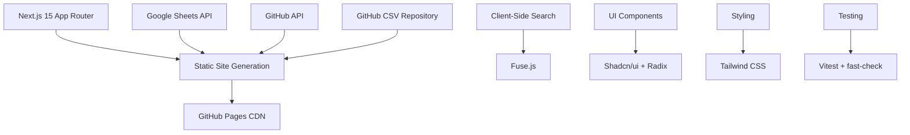

# 🚀 TrainWithShubham Community Hub

<div align="center">

**Empowering DevOps Engineers, Cloud Practitioners & DevSecOps Enthusiasts**

[](https://community.trainwithshubham.com)
[](https://pages.github.com/)
[](https://nextjs.org/)
[](https://www.typescriptlang.org/)
[](https://tailwindcss.com/)

*A modern, fully static Next.js platform for community learning through real-world projects, events, and collaborative growth.*

[🌟 Features](#-features) • [🏗️ Architecture](#️-architecture) • [🚀 Quick Start](#-quick-start) • [🤝 Contributing](#-contributing) • [📚 Documentation](#-documentation)

</div>

---

## ✨ Features

### 🎯 Core Capabilities

<table>
<tr>
<td width="50%">

#### 📅 **Events**
Community calendar powered by Google Calendar integration
- Real-time event synchronization
- Automated hourly updates
- Responsive event cards with details

</td>
<td width="50%">

#### 🏆 **Community Heroes**
Recognition program celebrating top contributors
- Three-tier achievement system
- Hero profiles with social links
- Filterable by tier level

</td>
</tr>
<tr>
<td width="50%">

#### 💼 **Projects**
GitHub-powered project catalog with live metadata
- ⭐ Stars, forks, and topic tags
- 📖 Integrated README viewer
- 🔍 Searchable by difficulty and tech stack

</td>
<td width="50%">

#### 💡 **Interview Questions**
Comprehensive Q&A for DevOps/Cloud interviews
- ⚡ Client-side fuzzy search (Fuse.js)
- 🔍 Advanced filtering (company, year, role, experience, topic)
- 📊 CSV export functionality
- 🔄 Real-time refresh from GitHub repository
- 📦 Powered by GitHub CSV (no database required)

</td>
</tr>
<tr>
<td width="50%">

#### 💼 **Jobs Board**
Community-driven job opportunities
- Latest DevOps/Cloud positions
- Terminal-style animations
- Direct application links

</td>
<td width="50%">

#### 🎨 **Modern UI/UX**
Beautiful, accessible interface
- 🌓 Dark/Light mode support
- 📱 Fully responsive design
- ♿ WCAG accessibility compliant

</td>
</tr>
</table>

### 🎯 Technical Highlights

- **🚀 Zero Hosting Cost** - Deployed to GitHub Pages with automated builds
- **⚡ Lightning Fast** - Fully static site generation, no server required
- **🔄 Auto-Updates** - Hourly rebuilds fetch fresh data automatically
- **🔍 Smart Search** - Client-side fuzzy search with Fuse.js
- **📦 Optimized Bundles** - 30%+ size reduction through code splitting
- **🧪 Test Coverage** - Property-based testing with fast-check
- **🎨 Component Library** - Shadcn/ui with Radix UI primitives
- **🔒 Type Safety** - Strict TypeScript with Zod validation

---

## 🏗️ Architecture

### Tech Stack



### Project Structure

```text
src/
├── app/                    # Next.js App Router (pages + layouts)
│   ├── events/            # Community events calendar
│   ├── heroes/            # Community heroes recognition
│   ├── projects/          # Project catalog with GitHub integration
│   ├── interview-questions/ # DevOps/Cloud Q&A
│   └── jobs/              # Job board
├── components/            # Shared UI components
│   ├── ui/               # Shadcn/ui components (40+ components)
│   ├── layout/           # Navbar, Footer, layouts
│   └── heroes/           # Hero-specific components
├── features/             # Feature-based modules
│   └── projects/         # Project listing logic
├── lib/                  # Core utilities
│   ├── client-search.ts  # Fuse.js wrapper
│   ├── data-fetcher.ts   # Build-time data fetching
│   └── utils.ts          # Shared utilities
├── services/             # External service wrappers
│   ├── google-sheets.ts  # Google Sheets CSV fetching (Jobs)
│   └── github-json.ts    # GitHub JSON fetching (Interview Questions)
└── data/                 # Type definitions & static data
```

### Data Flow

```text
┌─────────────────────────────────────────────────────────────┐
│                    Build Time (GitHub Actions)               │
├─────────────────────────────────────────────────────────────┤
│  1. Trigger (Push/Cron/Manual)                              │
│  2. Fetch Interview Questions from GitHub CSV               │
│  3. Fetch Jobs data from Google Sheets                      │
│  4. Fetch GitHub API metadata (stars, forks, topics)        │
│  5. Generate static HTML/CSS/JS                             │
│  6. Deploy to GitHub Pages CDN                              │
└─────────────────────────────────────────────────────────────┘
                            ↓
┌─────────────────────────────────────────────────────────────┐
│                    Runtime (Browser)                         │
├─────────────────────────────────────────────────────────────┤
│  • Static assets served from CDN                            │
│  • Client-side search with Fuse.js                          │
│  • Advanced filtering (6 filter types)                      │
│  • CSV export functionality                                 │
│  • Theme toggle (dark/light mode)                           │
│  • No server-side processing required                       │
└─────────────────────────────────────────────────────────────┘
```

---

## 🚀 Quick Start

### Prerequisites

- Node.js 20+ and npm
- Git

### Installation

```bash
# Clone the repository
git clone https://github.com/TrainWithShubham/community-website.git
cd community-website

# Install dependencies
npm install

# Start development server
npm run dev
```

Visit [http://localhost:3000](http://localhost:3000) to see the site in action! 🎉

### Available Scripts

```bash
# Development
npm run dev              # Start dev server with Turbopack
npm run build            # Production build (static export)
npm run lint             # Run ESLint
npm run typecheck        # TypeScript type checking

# Testing
npm run test             # Run all tests
npm run test:watch       # Run tests in watch mode
npm run test:ui          # Open Vitest UI

# Commits (Conventional Commits)
npm run commit           # Interactive commit prompt
npm run lint:commits     # Validate commit messages

# Utilities
npm run env:check        # Validate environment variables
npm run test:sheets      # Test Google Sheets connection
```

---

## 🤝 Contributing

We welcome contributions from the community! Whether you're fixing bugs, adding features, or improving documentation, your help is appreciated.

### Quick Contribution Guide

1. **Fork & Clone** the repository
2. **Create a branch** from `main`
   ```bash
   git checkout -b feat/your-feature-name
   ```
3. **Make your changes** with proper testing
4. **Commit using Conventional Commits**
   ```bash
   npm run commit  # Interactive prompt
   ```
5. **Push and create a Pull Request**

### Commit Convention

We use [Conventional Commits](https://www.conventionalcommits.org/) for clear, semantic commit history:

```text
type(scope): brief description

[optional body]
[optional footer]
```

**Types**: `feat`, `fix`, `docs`, `chore`, `build`, `ci`, `test`, `refactor`, `perf`, `style`

**Common Scopes**: `events`, `heroes`, `projects`, `interview-questions`, `jobs`, `ui`, `api`, `docs`, `ci`

**Examples**:
```bash
feat(heroes): add community heroes recognition program
fix(projects): correct GitHub API rate limiting
docs(readme): update installation instructions
test(heroes): add property-based tests for hero filtering
```

### Code Quality Standards

- ✅ TypeScript strict mode
- ✅ ESLint + Prettier formatting
- ✅ Unit tests for utilities
- ✅ Property-based tests for complex logic
- ✅ Accessibility compliance (WCAG)
- ✅ Responsive design (mobile-first)

### Getting Help

- 📖 Check [CONTRIBUTING.md](CONTRIBUTING.md) for detailed guidelines
- 🐛 Report bugs via [GitHub Issues](https://github.com/TrainWithShubham/community-website/issues)
- 💬 Join discussions in the community Discord
- 🏷️ Look for `good first issue` labels for beginner-friendly tasks

---

## 📚 Documentation

### Core Documentation

| Document | Description |
|----------|-------------|
| [📖 Deployment Guide](docs/DEPLOYMENT.md) | Complete deployment instructions, custom domain setup, troubleshooting |
| [🔄 Migration Report](docs/MIGRATION.md) | Vercel to GitHub Pages migration details, cost savings analysis |
| [🏗️ Project Structure](docs/PROJECT_STRUCTURE.md) | Detailed codebase organization and architecture |
| [🤝 Contributing Guide](CONTRIBUTING.md) | Comprehensive contribution guidelines and workflow |

### Key Concepts

#### Static Site Generation
All pages are pre-rendered at build time for maximum performance and zero hosting cost.

#### Automated Deployment
GitHub Actions workflow handles:
- ✅ Immediate deployment on push to `main`
- ✅ Hourly scheduled rebuilds for fresh data
- ✅ Manual deployment via GitHub Actions UI

#### Client-Side Search
Fuse.js provides fuzzy search without server infrastructure:
- ⚡ Instant results
- 🎯 Typo-tolerant matching
- 📦 Minimal bundle impact

---

## 🎯 Roadmap

### Current Focus
- [x] Community Heroes recognition program
- [x] Property-based testing infrastructure
- [x] Dark mode support
- [ ] Enhanced project filtering
- [ ] Event RSVP functionality
- [ ] User authentication (optional)

### Future Enhancements
- 📊 Analytics dashboard
- 🔔 Event notifications
- 🏆 Gamification features
- 📱 Progressive Web App (PWA)
- 🌍 Internationalization (i18n)
- 🤖 AI-powered recommendations

---

## 📊 Project Stats

### Migration Success (Dec 2024)

| Metric | Before (Vercel) | After (GitHub Pages) | Improvement |
|--------|----------------|---------------------|-------------|
| **Hosting Cost** | $240/year | $0/year | 💰 100% savings |
| **Bundle Size** | ~850 KB | ~595 KB | 📦 30% reduction |
| **Build Time** | ~45s | ~35s | ⚡ 22% faster |
| **Deployment** | Manual | Automated | 🤖 Fully automated |

### Test Coverage

- ✅ **59 tests** passing across 7 test suites
- ✅ **Property-based tests** with 100+ iterations each
- ✅ **Unit tests** for all core components
- ✅ **Integration tests** for critical flows

---

## 🙏 Acknowledgments

Built with ❤️ by the TrainWithShubham community

### Technologies Used

- [Next.js](https://nextjs.org/) - React framework
- [TypeScript](https://www.typescriptlang.org/) - Type safety
- [Tailwind CSS](https://tailwindcss.com/) - Styling
- [Shadcn/ui](https://ui.shadcn.com/) - Component library
- [Radix UI](https://www.radix-ui.com/) - Accessible primitives
- [Fuse.js](https://fusejs.io/) - Fuzzy search
- [Vitest](https://vitest.dev/) - Testing framework
- [fast-check](https://fast-check.dev/) - Property-based testing
- [GitHub Pages](https://pages.github.com/) - Hosting
- [GitHub Actions](https://github.com/features/actions) - CI/CD

---

## 📄 License

This project is licensed under the MIT License - see the [LICENSE](LICENSE) file for details.

---

<div align="center">

**[⬆ Back to Top](#-trainwithshubham-community-hub)**

Made with 💻 and ☕ by the TrainWithShubham Community

[](https://github.com/TrainWithShubham/community-website)
[](https://github.com/TrainWithShubham/community-website/fork)
[](https://github.com/TrainWithShubham/community-website/issues)
[](https://github.com/TrainWithShubham/community-website/pulls)

</div>
